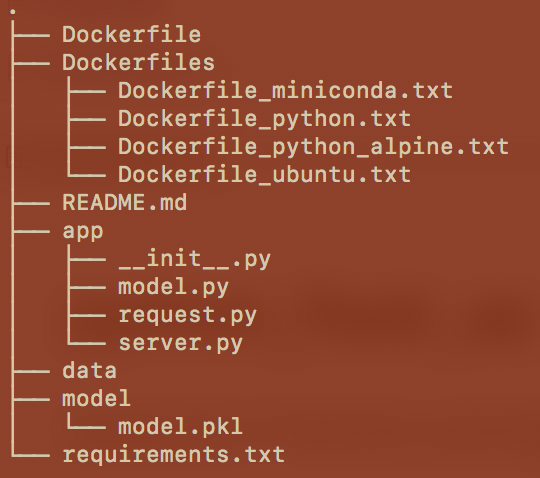
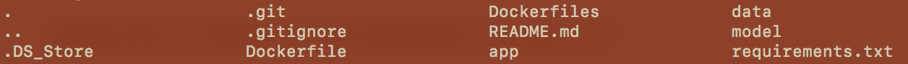

# Deployment of Machine Learning Model as a REST API

This template provides a basic structure of components for deploying a machine learning model as a REST API. A regression model is trained on publicly available dataset https://raw.githubusercontent.com/vyashemang/flask-salary-predictor/master/Salary_Data.csv that is salary earned as per years of work experience. This model is serialized as pickle file and made available for future use. A flask server is instantiated that accepts input data (years of experience) and provides prediction of salary using the trained model pickle file. Finally, option to build a docker image is provided to containerize the underlying application.

Keywords: Machine Learning, Python, Flask, Docker

### Package Directory


- Dockerfile: use this to build docker image and instantiate flask server inside a container 
- app/model.py: optional file to understand the data and associated regression model. 
- app/server.py: execution of this file (starting the flask server) is the ENTRYPOINT in the docker image
- model/model.pkl: serialized machine learning model that was saved after running app/model.py file
- requirements.txt: package requirements that are installed while building the docker image
- Dockerfiles/*: These dockerfiles are tested can serve as Dockerfile for building the image. Make sure to rename the file as Dockerfile without extension

Rest of the files and directories are optional and could be utilized as per the breadth and complexity of the package.


### Prerequisites

- Docker: Install Docker on Mac/Windows/Linux following this documentation https://docs.docker.com/
- Postman: This is optional. curl using terminal can also do the job. Refer this https://www.getpostman.com/downloads/ to install postman

### Installation

Once docker is installed on the computer. Follow these steps to start a container:
(Note that these steps are tested only on Mac Device)

1. Run Docker
2. Open terminal (and go to Package directory)
```sh
$ ls -a
```

```sh
$ docker build -t <image_name>:<tag> .
```
Example: > docker build -t python_package:01 .
This action will start building docker image
```sh
$ docker images
```
Note down the docker image id <IMAGE ID>
```sh
$ docker run -it -p 5000:5000 <IMAGE ID> 
```
This will start the container as well as start the flask server

3. Start Postman 
- URL: http://localhost:5000/api
- Body: {"exp":1.8}

4. (If not using Postman, then open a new window in terminal)
```sh
$ curl --header "Content-Type: application/json" --request POST --data '{"exp":1.8}' http://localhost:5000/api
```